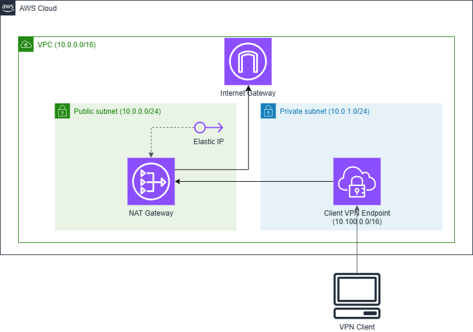

# Proxy Environment with a NAT gateway and VPN

This CDK construct sets up a VPC with a NAT gateway and a client VPN endpoint.
Users can connect to internet resources through the NAT gateway and VPN.

## How to set up the environment

1. Generate certificates and keys adn upload them to [ACM](https://aws.amazon.com/certificate-manager/).
  1. See [AWS Client VPN documentation](https://docs.aws.amazon.com/vpn/latest/clientvpn-admin/client-auth-mutual-enable.html) for instructions on how to generate certificates and keys and upload them to ACM. 
1. Deploy the stack using this construct.
  1. `example/` directory contains an example stack.
  1. This step requires ARN of the certificate and key uploaded to ACM.
1. Create the Client VPN endpoint configuration file
  1. See [official documentation](https://docs.aws.amazon.com/vpn/latest/clientvpn-admin/cvpn-getting-started.html#cvpn-getting-started-config) to download the configuration file and edit the file.
1. Distribute the configuration file to users.

## How to connect to the VPN

1. Download the AWS VPN client from [here](https://aws.amazon.com/vpn/client-vpn-download/).
2. See [official documentation](https://docs.aws.amazon.com/vpn/latest/clientvpn-user/connect-aws-client-vpn-connect.html) to connect to the VPN endpoint.